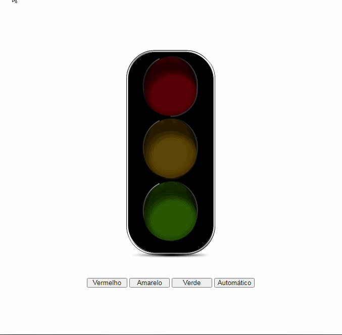

# Semáforo

## Vanilla JS

### Javascript
- Projeto em javascript puro
- Tecnologias utilizadas Html, Css e Javascript puro
- Neste projeto, o conteúdo aprendido foi a manipulação de DOM.
-  A animação executada após a interação do usuário ao clicar nos botôes.
- Conteúdo desenvolvido a partir de vídeo aula Fernando Leonid
[Javascript](https://www.youtube.com/watch?v=EujFSEsZsk4&ab_channel=FernandoLeonid)

 
 

	

